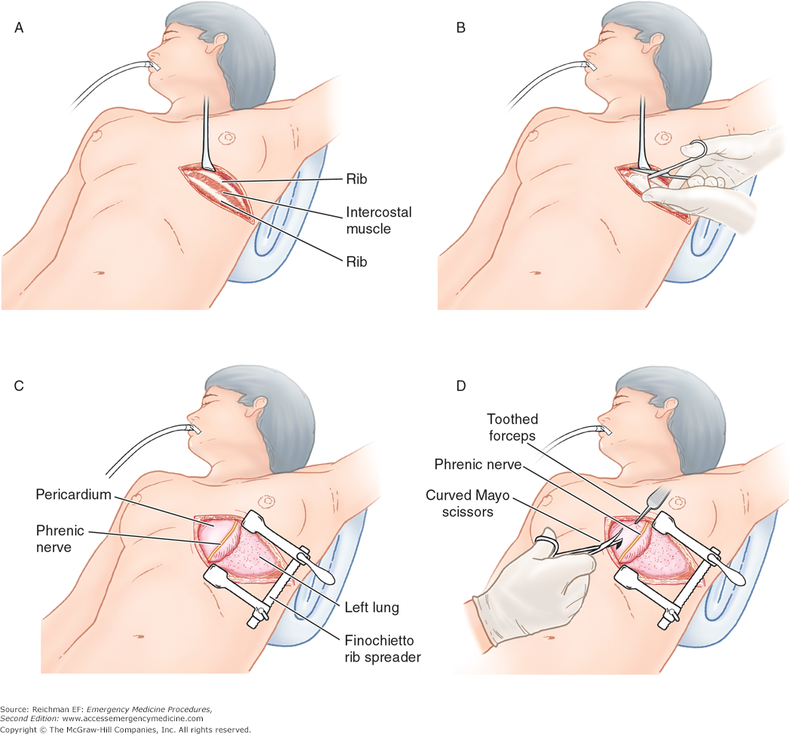

## BART with multiple treatments { .red }


<p class="red">
Michael Lopez, Liangyuan Hu, Chenyang Gu
https://github.com/statsbylopez/ci-bart
</p>


## 3 lung cancer treatments

Video assisted (VATS)


## 3 lung cancer treatments

Open thorectomy




## 3 lung cancer treatments

Robotic assisted


## 3 lung cancer treatments


```{r, echo = FALSE, warning = FALSE, message = FALSE}
library(tidyverse)
library(xtable)
library(nnet)
library(knitr)
library(ggjoy)
library(foreign)
mydata <- read.dta("~/Dropbox/ci-bart/Data/lung_raw.dta")

# treatment variable
trt = mydata$procedure_cat3 #  0=robotic, 1=open thoracotomy, 2=VATS
trt = trt + 1

# variables
age = mydata$agedx1_1
female = mydata$female
married = mydata$married
race = mydata$racethn_cat4
income = mydata$income_quartile # have missing values
comorbidity = mydata$ncishort_cat3
yrdiag = mydata$yrdx1_1
cancer_stage = mydata$stage22_ajcc7th
tumor_size = mydata$tumorsize_new
histology = mydata$histology
tumor_site = mydata$tumor_site
pet_scan = mydata$pet_scan2
chest_ct = mydata$chest_ct2
mediastinoscopy = mydata$mediastinoscopy2
#surgery_type = mydata$surgcode_seermed_cat3 # not in the original dataset

all_vars = cbind(age, female, married, factor(race), factor(income), factor(comorbidity), factor(yrdiag), factor(cancer_stage), factor(tumor_size), factor(histology), factor(tumor_site), factor(pet_scan), factor(chest_ct), factor(mediastinoscopy))
all_vars = as.data.frame(all_vars)
colnames(all_vars) = c("age","female","married","race","income","comorbidity","yrdiag","cancer_stage","tumor_size","histology","tumor_site","pet_scan","chest_ct","mediastinoscopy")

# outcome variables
#complication_any = mydata$complication_any
complication_resp = mydata$respiratory_complications30d
#death = mydata$po_mortality


# remove missing values from the variable "income"
miss.ind = ifelse(is.na(income), 1, 0)
trt2 = trt[miss.ind==0]
#complication_any2 = complication_any[miss.ind==0]
complication_resp2 = complication_resp[miss.ind==0]
all_vars2 = all_vars[miss.ind==0,]
#[1] 11980    14


cv.df <- cbind(all_vars2, trt2, complication_resp2)

df.sum <- cv.df %>% dplyr::group_by(trt2) %>% 
  summarise(n = n(), 
            ave.age = mean(age), 
            female = mean(female), 
            married = mean(married), 
            race1 = mean(race == 1), 
            race2 = mean(race == 2), 
            race3 = mean(race == 3), 
            race4 = mean(race == 4), 
            income1 = mean(income == 1),
            income2 = mean(income == 2),
            income3 = mean(income == 3),
            income4 = mean(income == 4), 
            comor1 = mean(comorbidity == 1), 
            comor2 = mean(comorbidity == 2), 
            comor3 = mean(comorbidity == 3), 
            cancer_stage1 = mean(cancer_stage == 1), 
            cancer_stage2 = mean(cancer_stage == 2), 
            cancer_stage3 = mean(cancer_stage == 3), 
            tumor_size1 = mean(tumor_size == 1), 
            tumor_size2 = mean(tumor_size == 2), 
            tumor_size3 = mean(tumor_size == 3), 
            histology1 = mean(histology == 1), 
            histology2 = mean(histology == 2), 
            histology3 = mean(histology == 3), 
            histology4 = mean(histology == 4), 
            tumor_site1 = mean(tumor_site == 1), 
            tumor_site2 = mean(tumor_site == 2), 
            tumor_site3 = mean(tumor_site == 3), 
            tumor_site4 = mean(tumor_site == 4), 
            pet_scan = mean(pet_scan == 2), 
            chest_ct = mean(chest_ct == 2), 
            mediastinoscopy = mean(mediastinoscopy == 2), 
            complication_resp2 = mean(complication_resp2)
  ) 

df.long <- df.sum %>% gather(variable, measurement, n:complication_resp2, factor_key = FALSE)
tab.highlight <- cbind(filter(df.long, trt2 == 1) %>% 
        select(variable, measurement), filter(df.long, trt2 == 3) %>% 
        select(measurement), filter(df.long, trt2 ==2) %>% 
        select(measurement)) 

names(tab.highlight) <- c("Variable", "robotic", "open.thoracotomy", "VATS")
tab.highlight <- tab.highlight %>% select(Variable, robotic, VATS, open.thoracotomy) %>% 
  mutate(robotic = round(robotic, 3), VATS = round(VATS, 3), open.thoracotomy = round(open.thoracotomy, 3))
library(knitr)
tab.highlight1 <- tab.highlight %>% filter(Variable %in% c("race1", "cancer_stage3", "income1", "complication_resp2"))
tab.highlight1$Variable <- c("Pct white", "Pct high income", "Pct Stage 3 cancer", "Complications")

kable(tab.highlight1 %>% filter(Variable != "Complications"))
```

## 3 lung cancer treatments

```{r,  echo = FALSE, message = FALSE, warning = FALSE}
kable(tab.highlight1)
```

## 3 lung cancer treatments


```{r, echo = FALSE, message = FALSE, warning = FALSE, fig.height = 4, fig.width=7}

### Implement VM here
library(arm)
library(nnet)
library(Matching)

form.VM <- formula(treat ~ age+ female +married +factor(race)+ factor(income) + factor(comorbidity) +
                     yrdiag + factor(cancer_stage) + factor(tumor_size) + factor(histology) +
                     factor(tumor_site) + factor(pet_scan) + factor(chest_ct) + factor(mediastinoscopy))

df.all <- data.frame(y1 = complication_resp2, trt = trt2, all_vars2)
df.all <- df.all %>% arrange(trt2)
y.vm <- df.all$y1
treat <- df.all$trt
mlogit.data <- df.all[,3:ncol(df.all)]

fit1 <- multinom(form.VM, data = mlogit.data, trace = FALSE)
pred.class.probs.logit <- fitted(fit1)
temp <- data.frame(fitted(fit1))
colnames(temp) <- c("p.1", "p.2", "p.3")
df.all <- cbind(df.all, temp)

df.graphs <- gather(df.all, "type", "weight", p.1:p.3)
df.graphs <- df.graphs %>% 
  mutate(truth = (type == "p.1" & trt == 1) | (type == "p.2" & trt == 2) | (type == "p.3" & trt == 3))
df.graphs$type <- relevel(as.factor(df.graphs$type), "p.2")

trt_names <- as_labeller(c(`p.1` = "Pr(Trt = Robot|X)",
                    `p.2` = "Pr(Trt = VATS|X)",
                    `p.3` = "Pr(Trt = Open|X)"))


df.graphs[df.graphs$trt ==1,]$trt <- "Robot"
df.graphs[df.graphs$trt ==2,]$trt <- "VATS"
df.graphs[df.graphs$trt ==3,]$trt <- "Open"

p0 <- ggplot(df.graphs, aes(x = weight, y = as.factor(trt))) + 
  geom_joy() + 
  facet_grid(~factor(type), labeller = trt_names) + 
  xlab("Probability of receiving treatment (GPS)") + ylab("Observed treatment") + 
  #scale_y_discrete(breaks = c(1, 2, 3)) + 
  ggtitle("Treatment assignment probabilities given covariates") 
p0

p1 <- ggplot(df.graphs, aes(x = weight, y = as.factor(trt))) + 
  geom_joy(aes(fill = truth)) + 
  facet_grid(~factor(type), labeller = trt_names) + 
  xlab("Probability of receiving treatment (GPS)") + ylab("Observed treatment") + 
  #scale_y_discrete(breaks = c(1, 2, 3)) + 
  ggtitle("Treatment assignment probabilities given covariates") + scale_fill_discrete("Received trt?")
```


## Issue 1: Selection bias


```{r, echo = FALSE, message = FALSE, warning = FALSE, fig.height = 4, fig.width=7}
p1 
```


## Issue 2: Non-overlapping distributions


```{r, echo = FALSE, message = FALSE, warning = FALSE, fig.height = 4, fig.width=7}
p1 
```


## Issue 3: Large weights


```{r, echo = FALSE, message = FALSE, warning = FALSE, fig.height = 4, fig.width=7}
df.text <- data.frame(x = 0, y = 3.2, weight = 0, trx = "Robot")
p2 <- ggplot(filter(df.graphs, type == "p.1"), aes(x = weight, y = as.factor(trt))) + 
  geom_joy(aes(fill = truth)) + 
   xlab("Probability of receiving treatment (GPS)") + ylab("Observed treatment") + 
  #scale_y_discrete(breaks = c(1, 2, 3)) + 
  ggtitle("Probability of receiving Robotic trt") + 
  scale_fill_discrete("Received trt?") + 
  xlim(c(-0.03, 0.25)) 
p2
#p2
#ggsave(p2, file = "p2new.png", height = 5, width = 7)
```


## Notation

Consider causal effect of $A \in \{1, \ldots, Z\}$ on binary outcome $Y \in \{0,1\}$

* $i = 1, \ldots, n$ for $n$ total subjects
    - $n = n_1 + \ldots +  n_Z$ 
* $\{Y_i(1), \ldots, Y_i(Z)\}$ as potential outcomes for $i$
* Covariates $X_i$

## Notation

Interest: average treatment effect among treated

> - $ATT_{1|1, a}$: effect of $T = 1$ versus $T = a$ among those with $T = 1$
>     - $ATT_{1|1, a}$ = $\frac{1}{n_1} \sum_{i:A_i = 1} (Y_i(1) - Y_i(a))$ for $a = \{2, \ldots, Z\}$

> - Ex: $Z$ = 3, $ATT_{1| 1, 2}$, $ATT_{1| 1, 3}$, $ATT_{1| 2, 3}$
>     - $ATT_{1|1, 2}$ = $\frac{1}{n_1} \sum_{i:A_i = 1} (Y_i(1) - Y_i(2))$
>     - $ATT_{1|1, 3}$ = $\frac{1}{n_1} \sum_{i:A_i = 1} (Y_i(1) - Y_i(3))$
>     - $ATT_{1|2, 3}$ = $\frac{1}{n_1} \sum_{i:A_i = 1} (Y_i(2) - Y_i(3))$
  

## Causal inference with multiple treatments

Why not binary approaches? 

> - May not fully account for differences in patient characteristics
> - Comparisons of disctinct cohorts with dissimilar characteristics
> - Challenging to identify optimal treatment
> - Main issue: matching on scalar alone insufficient
> - See [Lopez & Gutman, 2017](https://projecteuclid.org/euclid.ss/1504253125) for more


## Causal inference with multiple treatments

> - Inverse probability of treatment weighting ([Feng et al, 2012](http://onlinelibrary.wiley.com/doi/10.1002/sim.4168/full))
> - Generalized boosted models ([McCaffrey et al, 2013](http://onlinelibrary.wiley.com/doi/10.1002/sim.5753/full))
> - Matching ([Yang et al, 2016](http://onlinelibrary.wiley.com/doi/10.1111/biom.12505/full); [Lopez & Gutman, 2017](https://projecteuclid.org/euclid.ss/1504253125))


## Bayesian Additive Regression Trees

Why BART for causal inference? see [Hill, 2012](https://www.researchgate.net/profile/Jennifer_Hill3/publication/236588890_Bayesian_Nonparametric_Modeling_for_Causal_Inference/links/0deec5187f94192f12000000.pdf) 

- Flexibly models response surface `r emo::ji("heavy_check_mark")`
- Large number of continuous and categorical predictors `r emo::ji("heavy_check_mark")`
- No ambiguity with respect to balance assessment `r emo::ji("heavy_check_mark")`
- Accessibility `r emo::ji("heavy_check_mark")`
- Accuracy `r emo::ji("heavy_check_mark")`

## Bayesian Additive Regression Trees

Why BART for multiple treatments?

- Coherent posterior intervals `r emo::ji("question")`
- Heterogenous treatment effects `r emo::ji("question")`
- Accessibility `r emo::ji("question")`
- Accuracy `r emo::ji("question")`


## Simulation study

6 factorial design using `dbarts` package in R

- Ratio of $n_1$ : $n_2$ : $n_3$
- $n$
- No. of predictors 
- $P(A|X)$
- Predictor strength alignment 
- Response surfaces (parallel?)


## { .fullpage } 

<div class="fullpage height">

</div>


## 3 lung cancer treatments

*ATT's: generalizable to population receiving robotic treatment*

```{r, echo  = FALSE, warning = FALSE, message = FALSE, fig.height = 3.5, fig.width=6}
df.out <- data.frame(point.est = c(-0.049, -0.018, 0.015, 0.005), 
                     low.bound = c(-0.097, -0.071, -0.040, -0.045), 
                     upp.bound = c(-0.001, 0.036, 0.067, 0.055), 
                     type = c("Unadjusted", "BART", "Unadjusted", "BART"), 
                     metric = c("VATS vs. Robotic", "VATS vs. Robotic", "Open thor vs. Robotic", "Open thor vs. Robotic"))


##$ATE12
##      EST  LOWER UPPER
##RD -0.018 -0.071 0.036
##RR  0.952  0.811 1.103
##OR  0.931  0.729 1.167
##$ATE13
##     EST  LOWER UPPER
##RD 0.015 -0.040 0.067
##RR 1.048  0.880 1.220
##OR 1.077  0.831 1.353


ggplot(df.out, aes(type, point.est)) + 
  geom_point() + 
  geom_errorbar(aes(ymin = low.bound, ymax = upp.bound), width = 0.2) + facet_wrap(~metric) + coord_flip() + 
  scale_y_continuous(lim = c(-0.18, 0.1)) + 
  geom_hline(yintercept = 0, lty = 2, colour = "red") + xlab("")  + ylab("") + 
  theme_light(14)


#      EST  LOWER  UPPER |    EST  LOWER  UPPER 
#RD -0.065 -0.068 -0.061 | -0.032 -0.038 -0.026 

## BART results

#      EST  LOWER  UPPER |    EST  LOWER  UPPER 
#RD -0.029 -0.034 -0.024 | -0.015 -0.027 -0.007 
```


## Comments


> - Attentuation of effect comparing VATS vs. Robotic
>     - distinct cohorts

> - BART shows promise for causal inference with multiple treatments
>     - expanded simulations required
>     - formal paper ready sometime soon?


## Comments

Github site: [https://github.com/statsbylopez/ci-bart](https://github.com/statsbylopez/ci-bart)

Twitter: [\@statsbylopez](https://twitter.com/StatsbyLopez)