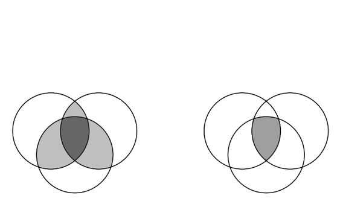

## BART with multiple treatments { .red }



<p class="red">
Michael Lopez, Liangyuan Hu, Chenyang Gu
https://github.com/statsbylopez/ci-bart
</p>

## The setting: 3 prostate cancer treatments

```{r, echo = FALSE, warning = FALSE, message = FALSE}
library(tidyverse)
library(xtable)
library(emojifont)
library(nnet)
library(knitr)
library(ggjoy)
dat0 <- read.csv("~/Dropbox/statsbylopez.github.io/ICHPS 2018/dat1.csv")

#some patients are treated at diagnosis
rx0 = filter(dat0,days2trx==0) #548 patients
dat0[dat0$days2trx==0,]$days2trx = .5
#which variable has missing data
#colSums(is.na(dat0))
dat = na.omit(dat0)

dat[dat$CS_SITESPECIFIC_FACTOR_8<=6,]$CS_SITESPECIFIC_FACTOR_8 = 6
dat[!dat$RACE %in% c(1,2),]$RACE = 3 #combine non-white & non-black race group
dat[dat$SPANISH_HISPANIC_ORIGIN %in% c(1:8),]$SPANISH_HISPANIC_ORIGIN = 1

dat = dat %>% mutate (tstage =ifelse(TNM_CLIN_T %in% c("3","3A","3B","4"),2,1))%>% select(-TNM_CLIN_T)
names(dat) = c("age","race","spanish","insurance","income","education","deyo","dyear","psa","gs", "surgsite", "regdose", "boostdose","surgseq","hormone","fupmonth","id","trx","days2trx","death","totdose","tstage")

dat = dat %>% mutate(dyearcat=ifelse(dyear %in% c(2004:2007), 1, ifelse(dyear %in% c(2008:2010),2,3)))

tab.out <- dat %>% group_by(trx) %>% summarise(n=n(), `Death Rate` = round(sum(death)/n, 3))
kable(tab.out)
```

## The setting: 3 prostate cancer treatments


```{r, echo = FALSE, message = FALSE, warning = FALSE, fig.height = 4, fig.width=7}
set.seed(3847293)
dat <- arrange(dat, trx)
# Obtain GPS
fit1 <- multinom(trx ~ psa + days2trx + age + factor(race) + spanish + factor(insurance) + factor(income) + factor(education) + factor(deyo) + factor(gs) + tstage + factor(dyearcat), data = dat, trace = FALSE)
temp <- data.frame(fitted(fit1))
colnames(temp) <- c("p.1", "p.2", "p.3")
dat1 <- cbind(dat, temp)
df.graphs <- dat1
df.graphs <- gather(df.graphs, "type", "weight", p.1:p.3)
df.graphs <- df.graphs %>% 
  mutate(truth = (type == "p.1" & trx == 1) | (type == "p.2" & trx == 2) | (type == "p.3" & trx == 3))
df.graphs$type <- relevel(as.factor(df.graphs$type), "p.2")

trt_names <- as_labeller(c(`p.1` = "Pr(Trt = RT 1|X)",
                    `p.2` = "Pr(Trt = Prostatectomy|X)",
                    `p.3` = "Pr(Trt = RT 2|X)"))


df.graphs[df.graphs$trx ==1,]$trx <- "RT 1"
df.graphs[df.graphs$trx ==2,]$trx <- "Prostatectomy"
df.graphs[df.graphs$trx ==3,]$trx <- "RT 2"

p0 <- ggplot(df.graphs, aes(x = weight, y = as.factor(trx))) + 
  geom_joy() + 
  facet_grid(~factor(type), labeller = trt_names) + 
  xlab("Probability of receiving treatment (GPS)") + ylab("Observed treatment") + 
  #scale_y_discrete(breaks = c(1, 2, 3)) + 
  ggtitle("Treatment assignment probabilities given covariates") 
p0

p1 <- ggplot(df.graphs, aes(x = weight, y = as.factor(trx))) + 
  geom_joy(aes(fill = truth)) + 
  facet_grid(~factor(type), labeller = trt_names) + 
  xlab("Probability of receiving treatment (GPS)") + ylab("Observed treatment") + 
  #scale_y_discrete(breaks = c(1, 2, 3)) + 
  ggtitle("Treatment assignment probabilities given covariates") + scale_fill_discrete("Received trt?")
```


## Issue 1: Selection bias


```{r, echo = FALSE, message = FALSE, warning = FALSE, fig.height = 4, fig.width=7}
p1 
```


## Issue 2: Non-overlapping distributions


```{r, echo = FALSE, message = FALSE, warning = FALSE, fig.height = 4, fig.width=7}
p1 
```


## Issue 3: Large weights


```{r, echo = FALSE, message = FALSE, warning = FALSE, fig.height = 4, fig.width=7}
library(emojifont)
df.text <- data.frame(x = 0, y = 3.2, weight = 0, trx = "RT 2")
p2 <- ggplot(filter(df.graphs, type == "p.3"), aes(x = weight, y = as.factor(trx))) + 
  geom_joy(aes(fill = truth)) + 
   xlab("Probability of receiving treatment (GPS)") + ylab("Observed treatment") + 
  #scale_y_discrete(breaks = c(1, 2, 3)) + 
  ggtitle("Probability of receiving RT 2") + 
  scale_fill_discrete("Received trt?") + 
  xlim(c(-0.03, 0.25)) 
#p2
#ggsave(p2, file = "p2.png", height = 5, width = 7)
```


## Issue 3: Large weights


```{r, echo = FALSE, message = FALSE, warning = FALSE, fig.height = 4, fig.width=7}
#p3 <- p2 + geom_emoji(data = df.text, emoji = "1f628")
#ggsave(p3, file = "p3.png", height = 5, width = 7)
```


## Notation

Consider causal effect of $A \in \{1, \ldots, Z\}$ on binary outcome $Y \in \{0,1\}$

* $i = 1, \ldots, n$ for $n$ total subjects
    - $n = n_1 + \ldots +  n_Z$ 
* $\{Y_i(1), \ldots, Y_i(Z)\}$ as potential outcomes for $i$
* Covariates $X_i$

## Notation

Interest: average treatment effect among treated

> - $ATT_{1|1, a}$: effect of $T = 1$ versus $T = a$ among those with $T = 1$
>     - $ATT_{1|1, a}$ = $\frac{1}{n_1} \sum_{i:A_i = 1} (Y_i(1) - Y_i(a))$ for $a = \{2, \ldots, Z\}$

> - Ex: $Z$ = 2, $ATT_{1| 1, 2}$, $ATT_{1| 1, 3}$, $ATT_{1| 2, 3}$
>     - $ATT_{1|1, 2}$ = $\frac{1}{n_1} \sum_{i:A_i = 1} (Y_i(1) - Y_i(2))$
>     - $ATT_{1|1, 3}$ = $\frac{1}{n_1} \sum_{i:A_i = 1} (Y_i(1) - Y_i(3))$
>     - $ATT_{1|2, 3}$ = $\frac{1}{n_1} \sum_{i:A_i = 1} (Y_i(2) - Y_i(3))$
  

## Causal inference with multiple treatments

Why not binary approaches? 

> - May not fully account for differences in patient characteristics
> - Comparisons of disctinct cohorts with dissimilar characteristics
> - Challenging to identify optimal treatment
> - Main issue: matching on scalar alone insufficient
> - See [Lopez & Gutman, 2017](https://projecteuclid.org/euclid.ss/1504253125) for more


## Causal inference with multiple treatments

> - Inverse probability of treatment weighting ([Feng et al, 2012](http://onlinelibrary.wiley.com/doi/10.1002/sim.4168/full))
> - Generalized boosted models ([McCaffrey et al, 2013](http://onlinelibrary.wiley.com/doi/10.1002/sim.5753/full))
> - Matching ([Yang et al, 2016](http://onlinelibrary.wiley.com/doi/10.1111/biom.12505/full); [Lopez & Gutman, 2017](https://projecteuclid.org/euclid.ss/1504253125))


## Bayesian Additive Regression Trees

BART model: 

- $P(Y=1|X=x, A=a) = \Phi(f(x,a))$ 
- $f(x,a)$ appromated using sum of trees
- $ATT$'s estimated using counterfactuals 
    - $ATT_{1|1, a} = \frac{1}{n_1} \sum_{i:A_i = 1}^{n} \Phi(f(1, x_i)) - \Phi(f(a, x_i))$
  

```{r, eval = FALSE, message = FALSE, warning = FALSE, echo = FALSE}
 
library(dbarts)
library(arm)

X1.tilde = model.matrix(death ~ psa + days2trx + age + factor(race) + spanish + factor(insurance) + factor(income) + factor(education) + factor(deyo) + factor(gs) + tstage + factor(dyearcat), data = dat[dat$trx==1,])

X2.tilde = model.matrix(death ~ psa + days2trx + age + factor(race) + spanish + factor(insurance) + factor(income) + factor(education) + factor(deyo) + factor(gs) + tstage + factor(dyearcat), data = dat[dat$trx==2,])

X3.tilde = model.matrix(death ~ psa + days2trx + age + factor(race) + spanish + factor(insurance) + factor(income) + factor(education) + factor(deyo) + factor(gs) + tstage + factor(dyearcat), data = dat[dat$trx==3,])

n1.tilde <- nrow(X1.tilde)
n2.tilde <- nrow(X2.tilde)
n3.tilde <- nrow(X3.tilde)


X.tilde = rbind(X1.tilde, X2.tilde, X3.tilde)

dat1 %>% 
  ggplot(aes(p.1, colour = as.factor(age < 55))) + geom_density() + facet_wrap(~trx)

xt <- cbind(dat$trx, X.tilde[,-1])
extrap <- xt[,4] < 45
#xt <- xt[extrap,]

# treatment 1 to 2 or 3
xp1 = xt[xt[,1]==1,]
xp2 = xp1
xp3 = xp1
xp2[,1] = 2  # switch treatment label. switch 'surgery' to 'RT'
xp3[,1] = 3  # switch 'surgery' to 'RT+implants'
#y = dat$death[extrap]
#treat = dat$trx[extrap]

y = dat$death
treat = dat$trx

bart_tot12 = bart(x.train = xt, y.train = y,  x.test = xp2)  #default number postserior draws is 1000
bart_tot13 = bart(x.train = xt, y.train = y,  x.test = xp3)  #default number posterior draws is 1000

# Average treatment effects on the treatment group 1 (ATTs)
n1 = nrow(xp1)
y1.hat = mean(y[treat==1])

att12.est = att13.est = NULL
n.sims <- 1000

for (m in 1:n.sims) {
   # potential outcomes for treatment group 1
   y12.hat = rbinom(n1, 1, pnorm(bart_tot12$yhat.test[m,]))
   y13.hat = rbinom(n1, 1, pnorm(bart_tot13$yhat.test[m,]))
   
   # risk difference
   att12.est[m] = y1.hat - mean(y12.hat)
   att13.est[m] = y1.hat - mean(y13.hat)
}


att12.mean = mean(att12.est)
att12.lower = quantile(att12.est, probs=0.025)
att12.upper = quantile(att12.est, probs=0.975)

att13.mean = mean(att13.est)
att13.lower = quantile(att13.est, probs=0.025)
att13.upper = quantile(att13.est, probs=0.975)


round(cbind(att12.lower, att12.mean, att12.upper), digits=3)
round(cbind(att13.lower, att13.mean, att13.upper), digits=3)

## Naive approach

#      EST  LOWER  UPPER |    EST  LOWER  UPPER 
#RD -0.065 -0.068 -0.061 | -0.032 -0.038 -0.026 

## BART results

#      EST  LOWER  UPPER |    EST  LOWER  UPPER 
#RD -0.029 -0.034 -0.024 | -0.015 -0.027 -0.007 

```


## Bayesian Additive Regression Trees

Why BART?

- Flexibly models response surface `r emo::ji("heavy_check_mark")`
- Large number of continuous and categorical predictors `r emo::ji("heavy_check_mark")`
- No ambiguity with respect to balance assessment `r emo::ji("heavy_check_mark")`
- Accessibility `r emo::ji("heavy_check_mark")`
- Accuracy `r emo::ji("heavy_check_mark")`

## Bayesian Additive Regression Trees

Why BART for multiple treatments?

- Heterogenous treatment effects `r emo::ji("heavy_check_mark")`
- Coherent posterior intervals `r emo::ji("heavy_check_mark")`
- Accessibility `r emo::ji("question")`
- Accuracy `r emo::ji("question")`


## Simulation study

6 factorial design

- Ratio of $n_1$ : $n_2$ : $n_3$
- $n$
- No. predictors 
- $P(A|X)$
- Predictive strength
- Parallel treatment surfaces


## Simulation results


## 3 prostate cancer treatments 

*ATT's: generalizable to population receiving RT 1*

```{r, echo  = FALSE, warning = FALSE, message = FALSE, fig.height = 3.5, fig.width=6}
df.out <- data.frame(point.est = c(-0.065, -0.029, -0.032, -0.015), 
                     low.bound = c(-0.068, -0.034, -0.038, -0.027), 
                     upp.bound = c(-0.061, -0.024, -0.026, -0.007), 
                     type = c("Unadjusted", "BART", "Unadjusted", "BART"), 
                     metric = c("RT 1 v. Prostatectomy", "RT 1 v. Prostatectomy", "RT 1 v. RT 2", "RT 1 v. RT 2"))

ggplot(df.out, aes(type, point.est)) + 
  geom_point() + 
  geom_errorbar(aes(ymin = low.bound, ymax = upp.bound), width = 0.2) + facet_wrap(~metric) + coord_flip() + 
  scale_y_continuous(lim = c(-0.08, 0)) + geom_hline(yintercept = 0, lty = 2, colour = "red") + xlab("")  + ylab("") + 
  theme_light(14)


#      EST  LOWER  UPPER |    EST  LOWER  UPPER 
#RD -0.065 -0.068 -0.061 | -0.032 -0.038 -0.026 

## BART results

#      EST  LOWER  UPPER |    EST  LOWER  UPPER 
#RD -0.029 -0.034 -0.024 | -0.015 -0.027 -0.007 


```


## Conclusions


