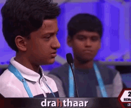

## The NFL's parity paradox { .white }


<p class="white">
Michael Lopez, Gregory Matthews, Benjamin Baumer
https://github.com/bigfour/competitiveness.
</p>

## Goals: the NFL's

> There are systems that we have to make sure that we maintain (parity).

> Carefully constructed system of competitive balance that makes NFL games and championship races so unpredictable and exciting.

**Roger Goodell, NFL commisioner**


> If you expect something to happen in this league, 
> it’s likely not going to happen. 

**Jonathan Kraft, President of New England Patriots**


## Goals: ours

1. Develop model to assess parity in professional sports
2. Does the NFL have parity?
3. How do NFL *systems* impact league outcomes? 


## Assess parity in professional sports

How to define parity

> the state or condition of being equal

**Google**


## Assess parity in professional sports

What parity looks like:


## Assess parity in professional sports

What parity does not look like: 


## A cross-sport model to assess parity


Motivation: Extend [Glickman and Stern, 1998](http://www.tandfonline.com/doi/abs/10.1080/01621459.1998.10474084)


## A cross-sport model to assess parity

* $p_{(q,s,k)ij}$ is probability that team $i$ will beat team $j$ in season $s$ during week $k$ of sports league $q$, for $q \in \{MLB, NBA, NFL, NHL\}$.
* $\alpha_{q_{0}}$ be the league-wide home advantage (HA) in $q$
* $\alpha_{(q) i^{\star}}$ be the extra effect (+ or -) for team $i$ when playing at home
* $\theta_{(q,s,k) i}$ and $\theta_{(q, s, k) j}$ be season-week team strength parameters 


## A cross-sport model to assess parity

\[ E[\text{logit}(p_{(q,s,k) ij})] = \theta_{(q,s,k) i} - \theta_{(q, s, k) j} + \alpha_{q_0} + \alpha_{(q) i^{\star}} \] 

Assumptions: 

1. $\sum_{i=1}^{t_{q}} \theta_{(q,s,k)i} = 0$
1. $E[\theta_{(i,q,s+1,1)}] = \gamma_{q, season} \theta_{(i, q,s,k)}$
1. $E[\theta_{(i,q,s,k+1)}] = \gamma_{q, week} \theta_{(i, q,s,k)}$
1. $\gamma_{q,week}$ and $\gamma_{q,season}$ week/season level autogressive parameters


## A cross-sport model to assess parity

What can our model tell us? A parity checklist

1. Unpredictability at a fixed time (variability of $\theta_{(q,s,k) i}$'s)
2. Within season unpredictability ($\gamma_{q, week}$)
3. Between season unpredictability ($\gamma_{q, season}$)


## A cross-sport model to assess parity

*Data*:  2006-2016 regular season games in MLB, NBA, NFL, NHL via Sports Insights

*Priors*: Uniform (variance parameters) and Normal (team strength parameters)

*Software*: `rjags` package in **R** statistical software 

*Draws*: 20k iterations, 2k burn in, thin of 5

## Model estimates

```{r, echo = FALSE, message = FALSE, warning = FALSE, fig.width= 6, fig.height = 3.5}
source("https://raw.githubusercontent.com/bigfour/competitiveness/master/config.R")
load(file.path(root, "data", "tidy_thetas.rda"))
tidy_thetas <- tidy_thetas %>%
  mutate(sport = toupper(sport),
         annotation = "",
         annotation = ifelse(theta == max(theta) & sport == "NFL", 
                             paste0("Strongest (", "Patriots", ")"), 
                             annotation),
         annotation = ifelse(theta < -1.56 & sport == "NFL", 
                             paste0("Weakest (", "Jags", ")"), 
                             annotation))
colors <- tidy_thetas %>%
  select(name, primary, secondary) %>%
  unique()
primary <- colors$primary
secondary <- colors$secondary
names(primary) <- colors$name
names(secondary) <- colors$name
library(teamcolors); library(ggthemes); library(stringi); library(forcats)

###### Football only
div <- c("AFC East", "AFC West", "AFC North", "AFC South", 
         "NFC East", "NFC West", "NFC North", "NFC South")
div.teams.NFL <- c(div[6], div[8], div[3], div[1], div[8], 
               div[3], div[3], div[5], div[7], div[2],
               div[7], div[7], div[4], div[4], div[4],
               div[2], div[6], div[1], div[7], div[1], div[8],
               div[5], div[1], div[2], div[5], div[3], 
               div[2], div[6], div[6],  div[8], 
               div[4], div[5])
divisions_nfl <- data_frame(sport = "nfl", division = div.teams.NFL)
divisions_nfl$team <- teamcolors %>%
  filter(sport == "nfl") %>%
  select(name) %>%
  unlist()

divisions <- divisions_nfl
teamcolors <- teamcolors %>%
  left_join(divisions, by = c("sport" = "sport", "name" = "team"))
tidy_thetas_division <- tidy_thetas %>%
  left_join(select(teamcolors, name, division), by = c("name" = "name")) %>%
  mutate(time_val = ifelse(sport == "NFL" | sport == "MLB",  time_val + 1, time_val))
max.theta <- round(max(tidy_thetas_division$theta), 2)
min.theta <- round(min(tidy_thetas_division$theta), 2)
ggplot(data = filter(tidy_thetas_division, division == "AFC North", season == 9), 
       aes(x = week, y = theta, 
           color = name, fill = name)) +
  geom_line(alpha = 0.5) + 
  geom_point(shape = 21, size = 0.5, alpha = 0.8) + 
  geom_text(aes(label = annotation), color = "black", hjust = "left", nudge_x = 0.25) + 
  scale_color_manual(name = NULL, values = primary) + 
  scale_fill_manual(name = NULL, values = secondary) + 
  scale_x_continuous(name = "Week", breaks = c(4, 8, 12, 16)) +
  scale_y_continuous(name = "Team Strength (log-odds scale)") + 
  guides(color = FALSE, fill = FALSE) +
  guides(color = guide_legend(ncol = 1)) +
  theme_grey(base_size = 14) + 
  labs(title = "Team strengths, 2014 season")
```


## Model estimates

```{r, echo = FALSE, message = FALSE, warning = FALSE, fig.width= 6, fig.height = 3.5}
ravens.time <- tidy_thetas_division %>% filter(sport == "NFL") %>% mutate(ravens = name == "Baltimore Ravens")
ravens <- ravens.time %>% filter(ravens)
ggplot(data = ravens.time, aes(x = time_val, y = theta, fill = name)) +
  geom_line(alpha = 0.5, colour = "grey") +    
  geom_point(size = 0.5, alpha = 0.8, colour = "grey") + 
  geom_text(aes(label = annotation), color = "black", hjust = "left", nudge_x = 0.25, size = 4) + 
  geom_line(data = ravens, aes(x = time_val, y = theta), alpha = 0.5, colour = "purple") +    
  geom_point(data = ravens, aes(x = time_val, y = theta), alpha = 0.8, colour = "purple") + 
  scale_x_continuous(name = "Week", breaks = c(2006, 2008, 2010, 2012, 2014, 2016)) +
  scale_y_continuous(name = "Team Strength (log-odds scale)") + 
  guides(color = FALSE, fill = FALSE) +
  #guides(color = guide_legend(ncol = 1)) +
  theme_grey(base_size = 14) + 
  labs(title = "Ravens team strength over time")
```

## { .fullpage }

<div class="fullpage width">
```{r, echo = FALSE}
spag <- ggplot(data = tidy_thetas_division, 
       aes(x = time_val, y = theta,  group = name)) +
  geom_line(alpha = 0.5) + 
  geom_point(shape = 21, size = 0.5, alpha = 0.8) + 
  #geom_text(aes(label = annotation), color = "black", hjust = "left", nudge_x = 0.25) + 
  #scale_color_manual(name = NULL, values = primary) + 
  #scale_fill_manual(name = NULL, values = secondary) + 
  scale_x_continuous(name = "Season", breaks = 2005:2016) +
  scale_y_continuous(name = "Team Strength (log-odds scale)") + 
  guides(color = FALSE, fill = FALSE) +
  #  guides(color = guide_legend(ncol = 2)) 
  theme_grey(14) + 
  ggtitle("Team strengths across 4 sports leagues")
spag + facet_wrap(~sport, ncol = 1)
```
</div>

## NFL's parity: unpredictability at a fixed point in time


How often does the best team win?


## NFL's parity: unpredictability by season

```{r, echo = FALSE, fig.width = 5.8, fig.height = 4.4}
load(file.path(root, "data", "params.R1.rda"))
#p.gamma <- ggplot(params, aes(x = gamma_w, y = gamma_s, color = toupper(sport))) + 
#  geom_vline(xintercept = 1, color = "darkgray", linetype = 2) + 
#  annotate("text", x = 1.001, y = 0.85, 
#           label = "Random\nWalk", hjust = "left") + 
#  geom_density_2d() + geom_point(alpha = 0.1) + 
#  xlab(expression(paste("Week-to-week consistency (", gamma[week],")")))+ 
#  ylab(expression(paste("Season-to-season consistency (", gamma[season],")")))+ 
#  scale_colour_brewer(palette = "Dark2", "League") + 
#  theme_grey(base_size = 14) 
#p.gamma

params1 <- params %>% select(-sigma_g, -sigma_w, -sigma_s, -alpha) %>% gather("type", "gamma", gamma_w:gamma_s) 
params1 <- filter(params1, type == "gamma_s" | gamma > 0.9)
library(ggjoy)


p1 <- ggplot(filter(params1, type == "gamma_s"), aes(x = gamma, y = toupper(sport), fill = sport == "nfl")) + 
  geom_joy() +xlim(c(0.4, 0.8)) + xlab("Less predictable                       More predictable") + ylab("") + 
  ggtitle(expression(paste("Season-to-season evolution of team strength (", gamma[season],")"))) + theme(plot.title = element_text(hjust = 0.5))+ 
  theme_grey(base_size = 12) + scale_fill_manual(values = c("grey", "red"))  + theme(legend.position="none") 

p2 <- ggplot(filter(params1, type == "gamma_w"), aes(x = gamma, y = toupper(sport), fill = sport == "nfl")) + 
  geom_joy() +xlim(c(0.96, 1.01)) + xlab("Less predictable                       More predictable") + ylab("") + 
  ggtitle(expression(paste("Season-to-season evolution of team strength (", gamma[week],")"))) + theme(plot.title = element_text(hjust = 0.5))+ 
  theme_grey(base_size = 12) + scale_fill_manual(values = c("grey", "red"))  + theme(legend.position="none") 
#library(gridExtra)
#grid.arrange(p1, p2, nrow = 1)


p1

```


## NFL's parity: unpredictability by week


```{r, echo = FALSE, fig.width = 5.8, fig.height = 4.4}
p2
```


## NFL systems that impact perceived parity


> * Small number of games 
> * Single elimination tournament 
> * Unbalanced schedule (focus of today)

## Effect of NFLs unbalanced schedule

2 games per year against like-placed teams from prior year (I'll call them "crossover" games).

$Hypothetical$: What if league-average teams were played instead?

$Approach$: Use team strength estimates to approximate change in expected wins

## Effect of NFLs unbalanced schedule

```{r, echo = FALSE, fig.width = 6.7, fig.height = 4.4}
load(file.path(root, "data", "nflparity.rda"))

### Crossover games
nfl.crossovers <- nfl.all %>% 
  filter(type == "crossover") %>% 
  group_by(team, season, type, lag.place.div) %>% 
  summarise(exp.wins = mean(exp.win.diff)*2) 

nfl.crossovers.sum <- nfl.crossovers %>% 
  ungroup() %>% 
  group_by(team) %>% 
  summarise(total.cost = round(sum(exp.wins), 2)) 

nfl.crossovers <- nfl.crossovers %>% left_join(nfl.crossovers.sum) %>% 
  mutate(nickname = stri_extract_last_words(team), 
         team.paste = paste0(nickname, " (", round(total.cost, 2), ")"))
# It's recommended to use a named vector
cols <- c("4" = "royalblue4", "3" = "skyblue1", "2" = "pink", "1" = "red")

#nfl.crossovers %>% group_by(lag.place.div) %>% summarise(delta = mean(exp.wins))


ggplot(filter(nfl.crossovers, team == "Indianapolis Colts"), aes(season, exp.wins)) + 
  geom_bar(stat = "identity") + 
  #geom_text(data = nfl.crossovers.sum, aes(2010, -0.4, label = total.cost)) + 
  #facet_wrap(~reorder(team.paste, total.cost), nrow = 4) +
  theme_tufte(14) +
  #scale_fill_manual(values = cols, "Prior division finish", labels = c("1st", "2nd", "3rd", "4th")) +   
  ggtitle("Change in expected wins by season, Colts crossover games") + 
  xlab("") + ylab("")

```


## Effect of NFLs unbalanced schedule

```{r, echo = FALSE, fig.width = 8.6, fig.height = 4.4}
ggplot(filter(nfl.crossovers, team == "Indianapolis Colts"), aes(season, exp.wins, 
           fill = factor(lag.place.div))) + geom_bar(stat = "identity") + 
  #geom_text(data = nfl.crossovers.sum, aes(2010, -0.4, label = total.cost)) + 
  #facet_wrap(~reorder(team.paste, total.cost), nrow = 4) +
  theme_tufte(14) +
  scale_fill_manual(values = cols, "Prior division finish", labels = c("1st", "2nd", "4th")) +     
  ggtitle("Change in expected wins by season, Colts crossover games") + 
  ylab("") + xlab("")

```


## { .fullpage }

<div class="fullpage width">
```{r, echo = FALSE}

ggplot(nfl.crossovers, aes(season, exp.wins, fill = factor(lag.place.div))) + geom_bar(stat = "identity") + 
  #geom_text(data = nfl.crossovers.sum, aes(2010, -0.4, label = total.cost)) + 
  facet_wrap(~reorder(team.paste, total.cost), nrow = 4) + theme_tufte() +
  scale_fill_manual(values = cols, "Prior division finish", labels = c("1st", "2nd", "3rd", "4th")) +   
  ggtitle("Change in expected wins, cross-over games (total wins cost or gained)") + 
  ylab("") + theme(axis.text.x = element_text(angle = 45, hjust = 1)) + xlab("")
```
</div>


## Effect of NFLs unbalanced schedule


> 1. Difference between last and first place in a division worth approximately one-third of a win in year following
> 2. Practical significance given 16 game schedule
> 3. Alternative effects: divisional games
> 4. Future work: compare to other sports

## Conclusion

Does NFL have parity? Not particularly

> * 


## Conclusion

Do NFL systems push records to 0.500? Sort of

> * 


## Acknowledgements: Greg and Ben

<p class="double">


</p>


## Summary: parity in the NFL

> 1. Unpredictability at a fixed time `r emo::ji("x")`
> 2. Within season unpredictability `r emo::ji("heavy_check_mark")`
> 3. Between season unpredictability `r emo::ji("x")`
> 4. Crossover games drive records to 0.500 `r emo::ji("heavy_check_mark")`

More info: Paper ([link](https://arxiv.org/abs/1701.05976)) & Github ([link](https://github.com/bigfour/competitiveness))


## { .fullpage }

<div class="fullpage width">
```{r, echo = FALSE}
### Divisional games
nfl.divisional <- nfl.all %>% 
  filter(type == "divisional") %>% 
  group_by(team, season, type, div_team) %>% 
  summarise(exp.wins = mean(exp.win.diff)*6) 

nfl.divisional.sum <- nfl.divisional %>% 
  ungroup() %>% 
  group_by(team) %>% 
  summarise(total.cost = round(sum(exp.wins), 2)) 

nfl.divisional <- nfl.divisional %>% left_join(nfl.divisional.sum) %>% 
  mutate(team.paste = paste0(team, " (", round(total.cost, 2), ")"))


p1 <- ggplot(nfl.divisional, aes(season, exp.wins, fill = div_team)) + 
  geom_bar(stat = "identity") + 
  facet_wrap(~fct_reorder(team, as.numeric(div_team)), nrow = 4) + 
  theme_tufte() + 
  ggtitle("Change in expected wins, divisional games") + 
  scale_fill_brewer(palette = "Accent") + theme(legend.position="none") + 
  xlab("") + ylab("")  + theme(axis.text.x = element_text(angle = 45, hjust = 1))
p1
```
</div>


