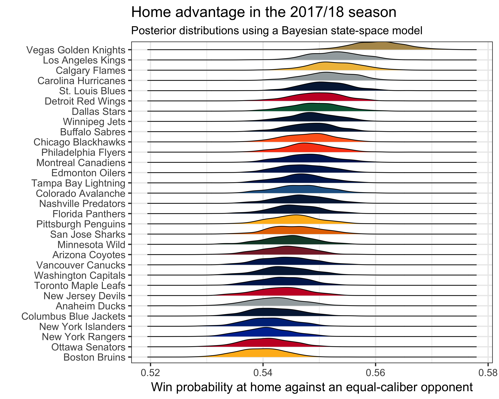
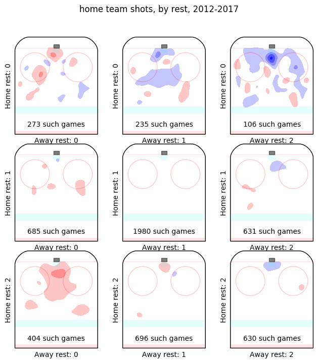
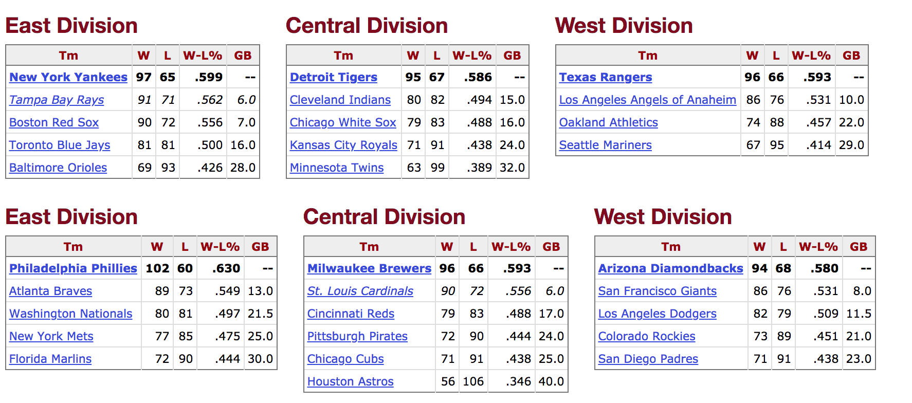

## Schedule strength in professional sports { .white }


<p class="white">
Michael Lopez (with Gregory Matthews and Benjamin Baumer)
https://github.com/bigfour/competitiveness.
</p>


## What we're told


## What we're told


## Traditional approach for understanding wins

<center>

*Wins* = *Skill* + *Luck*
</center>

> - Behind most strength of schedule metrics
> - Behind most approaches for assessing league parity

## Proposed approach for understanding

<center>
*Wins* = *Skill* + *Observable league factors* + *Unobservable factors*
</center>

*Observable league factors*:

> 1. Who you play and when you play them
> 2. Where you play
> 3. How rested you are

## Who you play and when you play them


```{r, echo = FALSE, message = FALSE, warning = FALSE, fig.width= 6, fig.height = 4}
library(broom)
library(knitr)
library(tidyverse)
library(teamcolors)
library(ggthemes)
library(ggridges)
library(forcats)
library(jpeg)
library(grid)
###### All sport betas
load("~/Dropbox/sports-schedules/data/alphas.RData")
load("~/Dropbox/sports-schedules/data/thetas.RData")
load("~/Dropbox/sports-schedules/data/params.RData")
load("~/Dropbox/sports-schedules/data/bigfour_rest.RData")

packers <- tidy_thetas %>% filter(name == "Green Bay Packers", season == 8)


image <- jpeg::readJPEG("~/Dropbox/statsbylopez.github.io/Toronto18/aaron.jpg")

p1 <- ggplot(data = filter(tidy_thetas, sport == "nfl", season == 8), 
       aes(x = week, y = theta, 
           group = name)) +
  geom_line(alpha = 0.8, colour = "grey") + 
  geom_point(shape = 21, size = 0.5, alpha = 0.8, colour = "grey") +
  geom_line(data = packers, size = 2, colour = "#ffb612") + 
  geom_point(data = packers, size = 2.5, colour = "#203731") + 
  #geom_text(aes(label = annotation), color = "black", hjust = "left", nudge_x = 0.25) + 
  scale_color_manual(name = NULL) + 
  scale_fill_manual(name = NULL) + 
  scale_x_continuous(name = "Week", breaks = c(4, 8, 12, 16)) +
  scale_y_continuous(name = "Team Strength (log-odds scale)") + 
  guides(color = FALSE, fill = FALSE) +
  guides(color = guide_legend(ncol = 1)) +
  theme_bw(base_size = 14) + 
  labs(title = "Team strengths, 2013 NFL season") + 
  annotate("text", x = 5, y = .95, label = "Green Bay", colour = "#203731", size = 4) 

p1

```


## Who you play and when you play them

```{r, echo = FALSE, message = FALSE, warning = FALSE, fig.width= 6, fig.height = 4}
p1 + annotation_custom(rasterGrob(image,  width = unit(1,"npc"), 
                               height = unit(1,"npc")), 
                    xmin = 12, xmax = 16, ymin = 0.5, ymax = 1.2) + 
  geom_segment(aes(x=12, xend=10.1, y=0.5, yend=.21), 
               arrow = arrow(length = unit(0.5, "cm")), colour = "#203731") 
```


## Where you play 

<left>

</left>


## How rested you are 




## Goals

- Incorporate *"observable league factors"* into a statistical model 
- Understand impact of rest and relative opponent strength
- Derive schedule metrics 


## A cross-sport model 

\[ E[\text{logit}(p_{(q,s,k) ij})] = \theta_{(q,s,k) i} - \theta_{(q, s, k) j} + \alpha_{q_0} + \alpha_{(q) i^{\star}} \]  

> * $p_{(q,s,k)ij}$ is probability that team $i$ will beat team $j$ in season $s$ during week $k$ of sports league $q$, for $q \in \{MLB, NBA, NFL, NHL\}$.
> * $\alpha_{q_{0}}$ and $\alpha_{(q) i^{\star}}$ correspond to home advantage
> * $\theta_{(q,s,k) i}$ and $\theta_{(q, s, k) j}$ be season-week team strength parameters 
> * See Ben's talk tomorrow for more detail


## A cross-sport model with rest

\[ E[\text{logit}(p_{(q,s,k) ij})] = \theta_{(q,s,k) i} - \theta_{(q, s, k) j} + \alpha_{q_0} + \alpha_{(q) i^{\star}} + \] 
\[ \beta_{(q,1)}(Rest_i) - \beta_{(q,2)}(Rest_j)\] 

> * $Rest_i$: indicator for team $i$ having a rest advantage
> * $Rest_j$: indicator for team $j$ having a rest advantage
> * $\beta_{(q,1)}$: benefit to home team of having rest
> * $\beta_{(q,2)}$: benefit to away team of having rest


## Worst rest differences, 2005-2016


```{r, echo = FALSE, message = FALSE, warning = FALSE, fig.width= 6, fig.height = 4}


betas <- params %>% select(beta_2, beta3, sport) %>% mutate(home = beta_2, away = -beta3) %>% 
  gather("beta", "value", home:away) %>% mutate(alpha.plot = ifelse(beta == "home", 0.6, 0.4))

betas.density <- betas %>% ggplot(aes(x = value, y = toupper(sport), fill = sport, lty = beta)) + 
  geom_density_ridges(alpha = 0.5) + xlab("Increased log-odds of a win") + ylab("") + 
  ggtitle("Increased win odds for rested teams") +
  theme(plot.title = element_text(hjust = 0.5)) + 
  theme_bw(base_size = 14)  +
  scale_linetype_manual(name = "Rested team", labels = c("Away", "Home"), 
                        values = c(1, 2))+ scale_fill_brewer(palette = "Dark2", guide = FALSE) 


alphas <- alphas.all %>% select(team, alpha.team.overall) %>% rename(home_team = team)
#params %>% group_by(sport) %>% summarise(ave.beta2 = mean(beta_2), ave.beta3 = mean(beta3))
beta2.est <- params %>% group_by(sport) %>% summarise(beta2.est = mean(beta_2))
beta3.est <- params %>% group_by(sport) %>% summarise(beta3.est = mean(beta3))

### Merge with thetas
tidy_thetas <- tidy_thetas %>% select(theta, season, week, name, sport, division) %>% mutate(season =  season + 2005)
bigfour.merged <- bigfour %>% select(Date, day, week, sport, season, home_team, visitor_team, home_win, p_home, rest.cat) %>% 
  left_join(tidy_thetas, by = c("sport", "season", "week", "home_team" = "name")) %>% 
  rename(theta_home = theta, division_home = division) %>% 
  left_join(tidy_thetas, by = c("sport", "season", "week", "visitor_team" = "name")) %>% 
  rename(theta_vis = theta, division_vis = division) %>% 
  mutate(rest.cat1 = case_when(rest.cat == "Same" ~ 0, 
                              rest.cat == "Home advantage" ~ 1, 
                              rest.cat == "Away advantage" ~ -1)) %>% 
  left_join(beta2.est) %>% 
  left_join(beta3.est) %>% 
  mutate(rest.advantage = (rest.cat1 == 1)*beta2.est + (rest.cat1 == -1)*beta3.est, 
         p_vis = 1-p_home, 
         vis_win = !home_win) %>% 
  left_join(alphas)
  
home.benefit <- bigfour.merged %>% 
  group_by(home_team, sport) %>% 
  summarise(num.benefit.home = sum(rest.cat == "Home advantage") - 
              sum(rest.cat == "Away advantage"), 
            benefit.ashome = sum(rest.cat == "Home advantage"), 
            detriment.ashome = sum(rest.cat == "Away advantage")) %>% 
  rename(team = home_team)

away.benefit <- bigfour.merged %>% 
  group_by(visitor_team, sport) %>% 
  summarise(num.benefit.away = sum(rest.cat == "Away advantage") - 
              sum(rest.cat == "Home advantage"), 
            benefit.asaway = sum(rest.cat == "Away advantage"), 
            detriment.asaway = sum(rest.cat == "Home advantage")) %>% 
  rename(team = visitor_team) %>% select(-sport)

rest.benefit <- home.benefit %>% inner_join(away.benefit) 


min.group <- rest.benefit %>% mutate(rest.difference.cum = num.benefit.home + num.benefit.away) %>% 
  group_by(sport) %>%
  arrange(rest.difference.cum) %>% 
  slice(1) %>%  ungroup() %>% mutate(sport = toupper(sport)) %>% 
  select(team, sport, benefit.ashome, detriment.ashome, benefit.asaway, detriment.asaway, rest.difference.cum) %>% 
  rename(Team = team, League = sport, 
         `Home+` = benefit.ashome, `Home-` = detriment.ashome, 
         `Road+` = benefit.asaway, `Road-` = detriment.asaway, 
         `Net rest` = rest.difference.cum) 

max.group <- rest.benefit %>% mutate(rest.difference.cum = num.benefit.home + num.benefit.away) %>% 
  group_by(sport) %>%
  arrange(-rest.difference.cum) %>% 
  slice(1) %>%  ungroup() %>% mutate(sport = toupper(sport)) %>% 
  select(team, sport, benefit.ashome, detriment.ashome, benefit.asaway, detriment.asaway, rest.difference.cum) %>% 
  rename(Team = team, League = sport, 
         `Home+` = benefit.ashome, `Home-` = detriment.ashome, 
         `Road+` = benefit.asaway, `Road-` = detriment.asaway, 
         `Net rest` = rest.difference.cum) 
kable(min.group, align=c(rep('l',times=2), rep('c',times=5)))
```


## Best rest differences, 2005-2016

```{r, echo = FALSE, message = FALSE, warning = FALSE, fig.width= 6, fig.height = 4}
kable(max.group, align=c(rep('l',times=2), rep('c',times=5)))
```


## 

```{r, echo = FALSE, message = FALSE, warning = FALSE, fig.width= 7.5, fig.height = 4.5}
rest.team <- rest.benefit %>% mutate(rest.difference.cum = num.benefit.home + num.benefit.away) %>% 
  ggplot(aes(x = toupper(sport), rest.difference.cum, colour = toupper(sport), label = team)) + geom_text() + 
  labs(title = "Rest detriment or benefit, in number of games", subtitle = "2005-2016 regular season games") + 
  scale_color_brewer(palette = "Dark2", guide = FALSE) + xlab("") + ylab("Number of games") + theme_bw(15) 
rest.team

```


## 

```{r, echo = FALSE, message = FALSE, warning = FALSE, fig.width= 7.5, fig.height = 4.5}
betas.density
```


## Dissecting a schedule


\[ E[\text{logit}(p_{(q,s,k) ij})] = \theta_{(q,s,k) i} - \theta_{(q, s, k) j} + \alpha_{q_0} + \alpha_{(q) i^{\star}} + \] 
\[ \beta_{(q,1)}(Rest_i) - \beta_{(q,2)}(Rest_j)\] 

* $\theta_{(q,s,k) i}$: skill.
* $\theta_{(q, s, k) j}$: who you play and when you play them
* $\alpha_{q_0}, \alpha_{(q) i^{\star}}$: where you play
* $\beta_{(q,1)}, \beta_{(q,2)}$: how rested you are


## Expected win totals

For team $i$ in sport $q$ in season $s$,

\[ Wins_{(q, s) i}|\theta_{(q,s,k) i}, \theta_{(q,s,k) j }, \alpha_{q_0}, \alpha_{(q) i^{\star}}, \beta_{(q,1)}, \beta_{(q,2)} = \]
\[\sum_{g}p_{(q,s,k) ij}*I(Home_{g,i} = 1) + \sum_{g}(1 - p_{(q,s,k) ij})*I(Home_{g,j} = 1)\]


## Expected win totals 

**Wins due to rest** =\[ Wins_{(q, s) i}|\theta_{(q,s,k) i}, \theta_{(q,s,k)j }, \alpha_{q_0}, \alpha_{(q) i^{\star}}, \beta_{(q,1)}, \beta_{(q,2)}  - \]
\[Wins_{(q, s) i}|\theta_{(q,s,k) i}, \theta_{(q,s,k)j }, \alpha_{q_0}, \alpha_{(q) i^{\star}}, \beta_{(q,1)} = 0, \beta_{(q,2)} = 0\]


## Expected win totals 

**Wins due to opponent caliber** =\[ Wins_{(q, s) i}|\theta_{(q,s,k) i}, \theta_{(q,s,k)j }, \alpha_{q_0}, \alpha_{(q) i^{\star}}, \beta_{(q,1)}, \beta_{(q,2)}  - \]
\[Wins_{(q, s) i}|\theta_{(q,s,k) i}, \theta_{(q,s,k)j } = 0, \alpha_{q_0}, \alpha_{(q) i^{\star}}, \beta_{(q,1)}, \beta_{(q,2)}\]

## Preliminary results

```{r, echo = FALSE, message = FALSE, warning = FALSE, fig.width= 7.5, fig.height = 4.5}
## Factor 1: opponent strength
## Factor 2: rest
## Factor 3: hold team home advantage constant

## p1: no opponent strength, no rest
## p2: opponent strength, no rest
## p3: no opponent strength, rest
## p4: opponent strength, rest


home.bigfour <- bigfour.merged %>% 
  select(sport, week, season, home_team, theta_home, theta_vis, p_home, home_win, alpha.team.overall, rest.advantage) %>% 
  rename(team = home_team, theta = theta_home, theta_opp = theta_vis, prob.markets = p_home, win = home_win) %>% 
  mutate(type = "home", 
         p1 = exp(theta + alpha.team.overall)/(1+exp(theta + alpha.team.overall)), 
         p2 = exp(theta - theta_opp + alpha.team.overall)/(1+exp(theta - theta_opp + alpha.team.overall)), 
         p3 = exp(theta + alpha.team.overall + rest.advantage)/(1+exp(theta + alpha.team.overall + rest.advantage)), 
         p4 = exp(theta - theta_opp + alpha.team.overall + rest.advantage)/(1+exp(theta - theta_opp + alpha.team.overall + rest.advantage)))

vis.bigfour <- bigfour.merged %>% 
  select(sport, week, season, visitor_team, theta_home, theta_vis, p_vis, vis_win, alpha.team.overall, rest.advantage) %>% 
  rename(team = visitor_team, theta = theta_vis, theta_opp = theta_home, prob.markets = p_vis, win = vis_win) %>% 
  mutate(type = "away", 
         p1 = exp(theta - alpha.team.overall)/(1+exp(theta - alpha.team.overall)), 
         p2 = exp(theta - theta_opp - alpha.team.overall)/(1+exp(theta - theta_opp - alpha.team.overall)), 
         p3 = exp(theta - alpha.team.overall - rest.advantage)/(1+exp(theta - alpha.team.overall - rest.advantage)), 
         p4 = exp(theta - theta_opp - alpha.team.overall - rest.advantage)/(1+exp(theta - theta_opp - alpha.team.overall - rest.advantage)))

bigfour.long <- bind_rows(home.bigfour, vis.bigfour)

#http://forum.skrimmage.com/t/the-impact-of-rest-on-recent-nhl-shot-rates/53


sim.long <- bigfour.long %>% gather("game_type", "prob", prob.markets, p1:p4) 

## Note: check one or two random games within each league using `sim.long`


expwins.diff <- sim.long %>% 
  group_by(game_type, sport, team, season) %>% 
  summarise(exp.wins = sum(prob)) %>% 
  spread(game_type, exp.wins) %>% 
  mutate(expwins.diff1 = prob.markets - p1, 
         expwins.diff2 = prob.markets - p2, 
         expwins.diff3 = prob.markets - p3, 
         expwins.diff4 = prob.markets - p4)


#expwins.diff1: cumulative difference if we held rest and opponent caliber constant
#expwins.diff2: difference if we held rest constant but kept opponent caliber as it currently is
#expwins.diff3: difference if we held opponent caliber constant but kept rest as it currently is
#expwins.diff4: best estimate of current market

colors <- teamcolors %>% select(name, league, primary, secondary, division) %>% rename(team = name, sport = league) 
colors$team[colors$team == "Los Angeles Chargers"] <- "San Diego Chargers"
colors$team[colors$team == "St. Louis Cardinals"] <- "St Louis Cardinals"
colors$division <- as.factor(colors$division)
  
expwins.diff <- expwins.diff %>% left_join(colors) %>% mutate(season = as.factor(season))
colourCount = 25
library(RColorBrewer)
getPalette = colorRampPalette(brewer.pal(8, "Dark2"))


sds.league <- sim.long %>% 
  filter(game_type == "prob.markets") %>% 
  group_by(sport, team, season) %>% 
  summarise(act.wins = sum(prob)) %>% 
  ungroup() %>% 
  group_by(sport, season) %>% 
  summarise(sd.wins = sd(act.wins)) %>% 
  mutate(season = as.factor(season))

expwins.diff <- expwins.diff %>% left_join(sds.league) %>% 
  mutate(expwins.diff2.std = expwins.diff2/sd.wins, 
         expwins.diff3.std = expwins.diff3/sd.wins)


jays <- expwins.diff %>% ungroup() %>% filter(team == "Toronto Blue Jays") %>% 
  select(team, season, expwins.diff2, expwins.diff3) %>% 
  mutate(expwins.diff2 = round(expwins.diff2, 2), 
         expwins.diff3 = round(expwins.diff3, 2)) %>% 
  rename(`Rest wins` = expwins.diff2, `Schedule wins` = expwins.diff3)


lakers <- expwins.diff %>% ungroup() %>% filter(team == "Los Angeles Lakers") %>% 
  select(team, season, expwins.diff2, expwins.diff3) %>% 
  mutate(expwins.diff2 = round(expwins.diff2, 2), 
         expwins.diff3 = round(expwins.diff3, 2)) %>% 
  rename(`Rest wins` = expwins.diff2, `Schedule wins` = expwins.diff3)


kable(jays %>% filter(season <2010), align=c(rep('l',times=2), rep('c',times=2)))
```


## Preliminary results

```{r, echo = FALSE, message = FALSE, warning = FALSE, fig.width= 7, fig.height = 4}
kable(lakers%>% filter(season <2010), align=c(rep('l',times=2), rep('c',times=2)))
```

## 

```{r, echo = FALSE, message = FALSE, warning = FALSE, fig.width= 7, fig.height = 4}

delta.rest <- expwins.diff %>% ungroup() %>%
  ggplot(aes(expwins.diff2, y = toupper(sport), fill = toupper(sport))) + 
  geom_density_ridges(alpha = 0.5) + labs(title = "Change in annual wins given rest differences") + 
  scale_fill_brewer(palette = "Dark2", "", guide = FALSE) + 
  xlab("More losses                               More wins") + ylab("") + 
  theme_bw(15) + xlim(c(-1.1, 1.1))

delta.rest.std <- expwins.diff %>% ungroup() %>%
  ggplot(aes(expwins.diff2.std, y = toupper(sport), fill = toupper(sport))) + 
  geom_density_ridges(alpha = 0.5) + labs(title = "Standardized change in annual wins given rest differences") + 
  scale_fill_brewer(palette = "Dark2", "", guide = FALSE) + 
  xlab("Standardized difference in win totals") + ylab("") + 
  theme_bw(15) +xlim(c(-0.1, 0.1))


delta.opp <- expwins.diff %>% ungroup() %>%
  ggplot(aes(expwins.diff3, y = toupper(sport), fill = toupper(sport))) + 
  geom_density_ridges(alpha = 0.5) + labs(title = "Change in annual wins given opponents") + 
  scale_fill_brewer(palette = "Dark2", "", guide = FALSE) + 
  xlab("More losses                               More wins") + ylab("") + 
  theme_bw(15)+xlim(c(-4.5, 4.5))

delta.opp.std <- expwins.diff %>% ungroup() %>%
  ggplot(aes(expwins.diff3.std, y = toupper(sport), fill = toupper(sport))) + 
  geom_density_ridges(alpha = 0.5) + labs(title = "Standardized change in annual wins given opponents") + 
  scale_fill_brewer(palette = "Dark2", "", guide = FALSE) + 
  xlab("Standardized difference in win totals") + ylab("") + 
  theme_bw(15)+xlim(c(-0.8, 0.8))

delta.rest
```


## 

```{r, echo = FALSE, message = FALSE, warning = FALSE, fig.width= 7, fig.height = 4}
delta.rest.std
```


## 

```{r, echo = FALSE, message = FALSE, warning = FALSE, fig.width= 7, fig.height = 4}
delta.opp
```


## 

```{r, echo = FALSE, message = FALSE, warning = FALSE, fig.width= 7, fig.height = 4}
delta.opp.std
```


## 

```{r, echo = FALSE, message = FALSE, warning = FALSE, fig.width= 7, fig.height = 4}
p0 <- expwins.diff %>% 
  filter(team == "Buffalo Bills") %>% 
  ggplot(aes(season, expwins.diff3, fill = expwins.diff3 > 0)) + geom_col(alpha = 0.5) +
  scale_fill_manual(values = c("red", "blue"), guide = FALSE)  + 
  theme_tufte(20) + 
  #facet_wrap(~fct_reorder(team, as.numeric(division)), nrow = 3) + 
  xlab("") + ylab("")  + labs(subtitle = "Buffalo Bills: change in expected wins given opponents") +
  theme(axis.text.x = element_text(angle = 45, hjust = 1)) + ylim(c(-0.65, 0.65))
p0
```


##


```{r, echo = FALSE, message = FALSE, warning = FALSE, fig.width= 7, fig.height = 4}
p0 + geom_segment(aes(x=2, xend=3, y=0.4, yend=.28), 
               arrow = arrow(length = unit(0.5, "cm"))) + 
  annotate("text", x = 2, y = 0.45, label = "Brady hurt", size = 4) 
```


##

```{r, echo = FALSE, message = FALSE, warning = FALSE, fig.width= 7, fig.height = 4}
p0 + 
  geom_segment(aes(x=5, xend=4, y=0.5, yend=.3), 
               arrow = arrow(length = unit(0.5, "cm")), colour = "#203731") + 
  geom_segment(aes(x=5, xend=7, y=0.5, yend=.42), 
               arrow = arrow(length = unit(0.5, "cm")), colour = "#203731") + 
  geom_segment(aes(x=5, xend=8, y=0.5, yend=.32), 
               arrow = arrow(length = unit(0.5, "cm")), colour = "#203731")   + 
  annotate("text", x = 5, y = 0.54, label = "Played the Browns", size = 4) 
```


## { .fullpage }

<div class="fullpage width">
```{r, echo = FALSE}
size.tufte <- 8
AL <- c("AL East", "AL West", "AL Central")
getPalette = colorRampPalette(brewer.pal(8, "Dark2"))
p3 <- expwins.diff %>% 
  ungroup() %>% 
  filter(sport == "mlb") %>% 
  mutate(american.league = division %in% AL) %>% 
  filter(american.league) %>% 
  ggplot(aes(season, expwins.diff3, fill = expwins.diff3 > 0)) + geom_col(alpha = 0.5) +
  scale_fill_manual(values = c("grey", "grey"), guide = FALSE)   + 
  theme_tufte(size.tufte) + 
  facet_wrap(~fct_reorder(team, as.numeric(division)), nrow = 3) + 
  xlab("") + ylab("")  + labs(title= "MLB: change in expected wins given opponents", 
                              subtitle = "American League") +
  theme(axis.text.x=element_blank(),axis.ticks.x=element_blank()) 
p3
```
</div>


## { .fullpage }

<div class="fullpage width">
```{r, echo = FALSE}
size.tufte <- 8
AL <- c("AL East", "AL West", "AL Central")
getPalette = colorRampPalette(brewer.pal(8, "Dark2"))
p3 <- expwins.diff %>% 
  ungroup() %>% 
  filter(sport == "mlb") %>% 
  mutate(american.league = division %in% AL) %>% 
  filter(american.league) %>% 
  ggplot(aes(season, expwins.diff3, fill = expwins.diff3 > 0)) + geom_col(alpha = 0.5) +
  scale_fill_manual(values = c("grey", "red", "grey", "blue"), guide = FALSE)   + 
   theme_tufte(size.tufte) + 
  facet_wrap(~fct_reorder(team, as.numeric(division)), nrow = 3) + 
  geom_col(data = filter(expwins.diff, division == "AL East"), 
           aes(fill = ifelse(expwins.diff3 > 0, "blue", "red"))) + 
  xlab("") + ylab("")  + labs(title= "MLB: change in expected wins given opponents", 
                              subtitle = "American League") +
  theme(axis.text.x=element_blank(),axis.ticks.x=element_blank()) 
p3
```
</div>


## { .fullpage }

<div class="fullpage width">
```{r, echo = FALSE}
size.tufte <- 8
AL <- c("AL East", "AL West", "AL Central")
getPalette = colorRampPalette(brewer.pal(8, "Dark2"))
p3 <- expwins.diff %>% 
  ungroup() %>% 
  filter(sport == "mlb") %>% 
  mutate(american.league = division %in% AL) %>% 
  filter(american.league) %>% 
  ggplot(aes(season, expwins.diff3, fill = expwins.diff3 > 0)) + geom_col(alpha = 0.5) +
  scale_fill_manual(values = c("red", "blue"), guide = FALSE)   + 
  theme_tufte(size.tufte) + 
  facet_wrap(~fct_reorder(team, as.numeric(division)), nrow = 3) + 
  xlab("") + ylab("")  + labs(title= "MLB: change in expected wins given opponents", 
                              subtitle = "American League") +
  theme(axis.text.x=element_blank(),axis.ticks.x=element_blank()) 
p3
```
</div>


## { .fullpage }

<div class="fullpage width">
```{r, echo = FALSE}
size.tufte <- 8
AL <- c("AL East", "AL West", "AL Central")
getPalette = colorRampPalette(brewer.pal(8, "Dark2"))
vline.data <- data.frame(team = "Houston Astros", division = "AL West", xintercept = 7)
astros.league <- data.frame(team = "Houston Astros", division = "AL West", season = c(3.5, 10), expwins.diff3 = -3, label = c("NL", "AL"))
p3 <- expwins.diff %>% 
  ungroup() %>% 
  filter(sport == "mlb") %>% 
  mutate(american.league = division %in% AL) %>% 
  filter(american.league) %>% 
  ggplot(aes(season, expwins.diff3, fill = expwins.diff3 > 0)) + geom_col(alpha = 0.5) +
  scale_fill_manual(values = c("blue", "grey", "red", "grey"), guide = FALSE)   + 
   theme_tufte(size.tufte) + 
  facet_wrap(~fct_reorder(team, as.numeric(division)), nrow = 3) + 
  geom_col(data = filter(expwins.diff, team == "Houston Astros"), 
           aes(fill = ifelse(expwins.diff3 > 0, "blue", "red"))) + 
  xlab("") + ylab("")  + labs(title= "MLB: change in expected wins given opponents", 
                              subtitle = "American League") +
  theme(axis.text.x=element_blank(),axis.ticks.x=element_blank()) + 
  geom_vline(data = vline.data, aes(xintercept = xintercept), lty = 2) + 
  geom_text(data = astros.league, aes(season, expwins.diff3, label = label)) 
p3
```
</div>


## { .fullpage }

<div class="fullpage width">
```{r, echo = FALSE}
size.tufte <- 8
AL <- c("AL East", "AL West", "AL Central")
getPalette = colorRampPalette(brewer.pal(8, "Dark2"))
p3 <- expwins.diff %>% 
  filter(sport == "mlb") %>% 
  mutate(american.league = division %in% AL) %>% 
  filter(american.league) %>% 
  ggplot(aes(season, expwins.diff3, fill = expwins.diff3 > 0)) + geom_col(alpha = 0.5) +
  scale_fill_manual(values = c("red", "blue"), guide = FALSE)  + 
  theme_tufte(size.tufte) + 
  facet_wrap(~fct_reorder(team, as.numeric(division)), nrow = 3) + 
  xlab("") + ylab("")  + labs(title= "MLB: change in expected wins given opponents", 
                              subtitle = "American League") +
  theme(axis.text.x=element_blank(),axis.ticks.x=element_blank())

getPalette = colorRampPalette(brewer.pal(8, "Set1"))
p4 <- expwins.diff %>% 
  filter(sport == "mlb") %>% 
  mutate(american.league = division %in% AL) %>% 
  filter(!american.league) %>% 
  ggplot(aes(season, expwins.diff3, fill = expwins.diff3 > 0)) + geom_col(alpha = 0.5) +
  scale_fill_manual(values = c("red", "blue"), guide = FALSE)  + 
  theme_tufte(size.tufte) + 
  facet_wrap(~fct_reorder(team, as.numeric(division)), nrow = 3) + 
  xlab("") + ylab("")  + labs(subtitle = "National League") +
  theme(axis.text.x = element_text(angle = 45, hjust = 1))

library(patchwork)
p3 + p4 + plot_layout(ncol = 1)
```
</div>


## { .fullpage }

<div class="fullpage width">
```{r, echo = FALSE}

## rest ranks: NBA 1, NFL/NHL 2, MLB 3
## schedule ranks: MLB/NFL 1, NHL/NBA 2


east <- c("Atlantic", "Central", "Southeast")
getPalette = colorRampPalette(brewer.pal(8, "Dark2"))
p1 <- expwins.diff %>% 
  filter(sport == "nba") %>% 
  mutate(eastern.conference = division %in% east) %>% 
  filter(eastern.conference) %>% 
  ggplot(aes(season, expwins.diff3, fill = expwins.diff3 > 0)) + geom_col(alpha = 0.5) +
  scale_fill_manual(values = c("red", "blue"), guide = FALSE)  + 
  theme_tufte(size.tufte) + 
  facet_wrap(~fct_reorder(team, as.numeric(division)), nrow = 3) + 
  xlab("") + ylab("")  + labs(title= "NBA: change in expected wins given opponent caliber", 
                              subtitle = "Eastern Conference") +
  theme(axis.text.x=element_blank(),axis.ticks.x=element_blank())

getPalette = colorRampPalette(brewer.pal(8, "Set1"))
p2 <- expwins.diff %>% 
  filter(sport == "nba") %>% 
  mutate(eastern.conference = division %in% east) %>% 
  filter(!eastern.conference) %>% 
  ggplot(aes(season, expwins.diff3, fill = expwins.diff3 > 0)) + geom_col(alpha = 0.5) +
  scale_fill_manual(values = c("red", "blue"), "Western conference", guide = FALSE)  + 
  theme_tufte(size.tufte) + 
  facet_wrap(~fct_reorder(team, as.numeric(division)), nrow = 3) + 
  xlab("") + ylab("")  + labs(subtitle = "Western Conference") +
  theme(axis.text.x = element_text(angle = 45, hjust = 1))

library(patchwork)
p1 + p2 + plot_layout(ncol = 1)
```
</div>


## { .fullpage }

<div class="fullpage width">

```{r, echo = FALSE}


## NFL


#expwins.diff %>% 
#  filter(sport == "nfl") %>% 
#  ggplot(aes(season, expwins.diff3, fill = division)) + geom_col() +
#  scale_fill_manual(values = getPalette(colourCount))  + 
#  theme_tufte() + 
#  facet_wrap(~fct_reorder(team, as.numeric(division)), nrow = 4) + 
#  xlab("") + ylab("")  + ggtitle("NFL: change in expected wins given opponent caliber") +
#  theme(axis.text.x = element_text(angle = 45, hjust = 1))


AFC <- c("AFC East", "AFC North", "AFC South", "AFC West")
getPalette = colorRampPalette(brewer.pal(8, "Dark2"))
p5 <- expwins.diff %>% 
  filter(sport == "nfl") %>% 
  ggplot(aes(season, expwins.diff3, fill = expwins.diff3 > 0)) + geom_col(alpha = 0.5) +
  scale_fill_manual(values = c("red", "blue"), guide = FALSE)  + 
  theme_tufte(size.tufte) + 
  facet_wrap(~fct_reorder(team, as.numeric(division)), nrow = 8) + 
  xlab("") + ylab("")  + labs(title= "NFL: change in expected wins given opponent caliber") +
  theme(axis.text.x=element_blank(),axis.ticks.x=element_blank())
p5 


```


</div>


## Conclusions with respect to rest

- Small but non-negligible differences in rest
- NBA with largest rest impact, MLB with smallest
- Rest differences tend to even out over time
- Part of what's considered a home advantage may be a rest advantage

## Conclusions with respect to opponent strength

- Large differences in schedule strength in NFL and MLB
  - Persistent in MLB, more variable in NFL
- Less of a schedule impact in NBA (conference differences aside)
- Small role of schedule in NHL

## Conclusions with respect to opponent strength

- St. Louis Cardinals with easiest schedule (+ 2.2 wins a year)
- Baltimore Orioles with most difficult schedule (-2.8 wins a year)

## Should this team have made the playoffs?

2011 World Series winning Cardinals (90 wins, +3.3 opponent wins)




## Summary: 

> - In which sport does rest matter the most? `r emo::ji("basketball")`
> - In which sport does opponent strength matter the most? `r emo::ji("baseball")`, `r emo::ji("football")`
> - In which sport is there a persistent schedule (dis)advantage? `r emo::ji("baseball")`

More info: Paper (https://arxiv.org/abs/1701.05976), Github (https://github.com/bigfour/competitiveness)

## References

["How often does the best team win?", Lopez/Baumer/Matthews](https://arxiv.org/pdf/1701.05976.pdf)

["The Vegas Flu", Lopez, 2018](http://statsbylopez.netlify.com/post/the-vegas-flu-looks-real/)

["Impact of rest", McCurdy, 2017](http://forum.skrimmage.com/t/the-impact-of-rest-on-recent-nhl-shot-rates/53)

["Scheduling effects in the NBA and NHL...", Osborne, 2017 NESSIS](http://nessis.org/confirmed-presenters.html)

